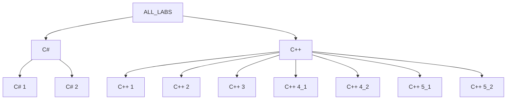

## 📘 Лабораторки по програмированию 📘

Здесь я размещаю все текущие лабораторные работы.  
Задания выкладываются здесь:

- [ Лабораторные работы по C++](https://drive.google.com/drive/folders/1_F-8I2-DN5b8p6-kbm6cEQAcjFATuoMa)
- [ Лабораторные работы по C#](https://drive.google.com/drive/folders/1rwWDtmsvWua6DeTQ_o7r-3eUKcDsQHDD)

## Cтруктура проекта на данный момент:
<details>
<summary>ДИАГРАММА</summary>


</details>


## 🚀 Языки программирования

### C++ ПРИМЕР
```cpp
#include <iostream>
int main() {
    std::cout << "Hello world!\n";
    return 0;
}
```
- **Тип**: Компилируемый, статически типизированный  
- **Парадигма**: Мультипарадигменный (ООП, процедурный, generic)  
- **Сильные стороны**:  
  - Высокая производительность  
  - Прямой доступ к памяти  
  - Богатая стандартная библиотека (STL)  
- **Использование**: Игры, драйверы, высоконагруженные системы  

### C# ПРИМЕР
```csharp
using System;
class Program {
    static void Main() {
        Console.WriteLine("Hello World!");
    }
}
```
- **Тип**: Компилируемый в байт-код, управляемый  
- **Парадигма**: Объектно-ориентированный  
- **Сильные стороны**:  
  - Простота изучения  
  - Богатая экосистема (.NET)  
  - Автоматическое управление памятью (GC)  
- **Использование**: Веб-приложения, десктоп (WPF), игры (Unity)  
      
| Характеристика   | C++ | C# |
|----------------------|-------------------|-------------------|
| Управление памятью   | Вручную           | Автоматическое (GC) |
| Производительность   | ⭐⭐⭐⭐⭐          | ⭐⭐⭐⭐           |
| Скорость разработки  | ⭐⭐⭐             | ⭐⭐⭐⭐⭐          |
| Кроссплатформенность | Да                | Да (.NET Core)    |


